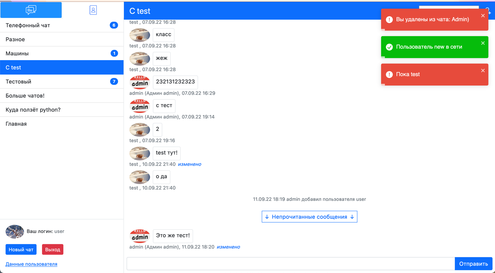
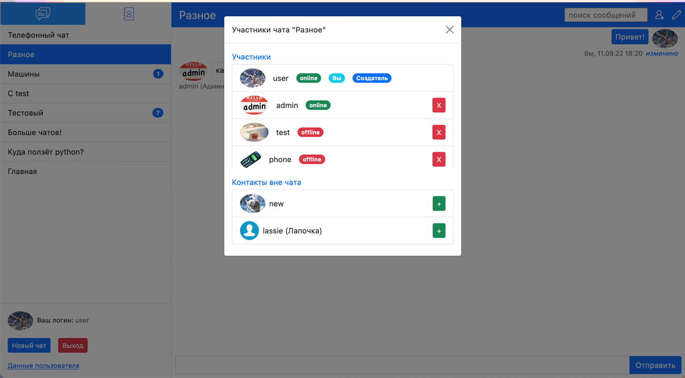
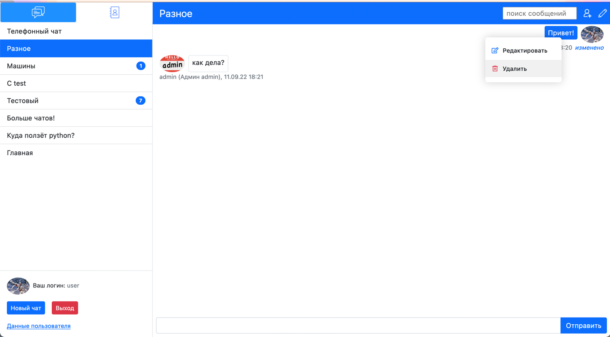
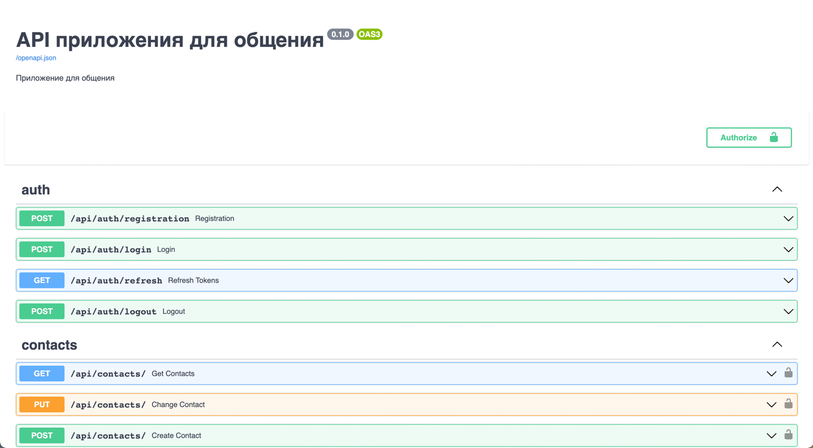
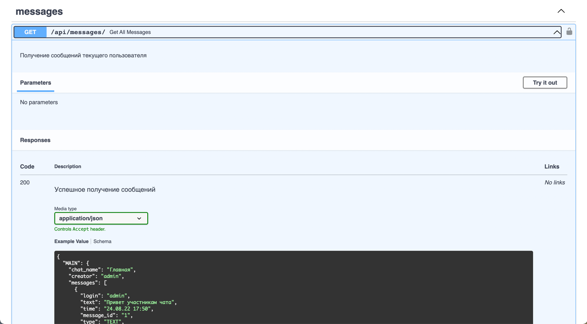
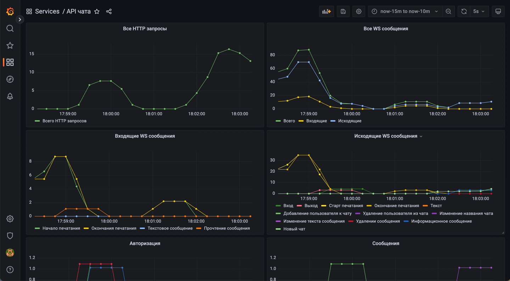

# Простой чат

## Возможности
 - Обмен текстовыми сообщениями в онлайн режиме
 - Изменение и удаление сообщений
 - Создание чатов, изменение названия чата
 - Добавление и удаление участников в чат
 - Система контактов (добавление, редактирование, удаление)
 - Профили пользователей, аватарки пользователей
 - Поиск сообщений в чате по тексту
 - Кнопка прокрутки чата вниз
 - Отображение пользователей, печатающих сообщения
 - Отображение новых сообщений их количества для каждого чата отдельно
 - Упорядочивание чатов по новым сообщениям
 - Запоминание прокрутки чата
 - Запоминание набранного текста в чате
 - Отображение онлайн статуса участников чата и обновление в реальном времени
 - Отображение уведомлений (вход/выход пользователей, добавление/удаления из чата)
 
 
 
 
## Технические особенности
- Backend на FastAPI, работа с базой c помощью SQLAlchemy
- Frontend на React, SPA, управление состоянием с помощью MobX. Хостинг build frontend через endpoint backend'а
- Управление отображением логов frontend'а в консоли браузера с помощью переменной окружения
- Полностью документированный API с примерами ответов доступен по /docs

- JWT авторизация
- WebSocket'ы для уведомления frontend'а о новых событиях: текстовые сообщения, вход/выход пользователей, изменение чатов, изменение/удаление сообщений, начало и конец набора пользователями текста
- Автоматическое переподключение frontend'а к Websocket
- Сбор метрик выполнения запросов с помощью Prometheus
- Отображение в почти реальном времени графиков выполненных запросов в Grafana

- Coverage 98%

## Запуск
Перед запуском необходимо заполнить файл .env в корне проекта. Обязательные переменные окружения:  
 - APP_WS_ADDRESS - хост:порт по которому подключаться к backend(8002 порт зашит в docker-compose.yaml )
 - ADMIN_PASSWORD - пароль админской учётной записи основного приложения(логин admin) 
 - GF_SECURITY_ADMIN_PASSWORD - пароль админской учётной записи для Grafana(логин admin)  
 - JWT_ACCESS_SECRET - строка ключ для шифрования access токена
 - JWT_REFRESH_SECRET - строка ключ для шифрования refresh токена
 
Опциональные переменные окружения(если не указаны, то будут использованы значения по умолчанию):
 - SQLALCHEMY_CONNECTION_URL - строка подключения к БД для SQLAlchemy, если не указана, то будет использоваться база sqlite
 - JWT_ACCESS_EXPIRES_S - срок действия(в секундах) access токена. По умолчанию 60 * 15 (15 минут)
 - JWT_REFRESH_EXPIRES_S - срок действия(в секундах) refresh токена. По умолчанию 60 * 60 * 24 * 30 (30 дней)
 - FRONTEND_DEBUG_MODE - debug режим для frontend, если значение находится в списке ["1", "true", 'yes', 'on'],
то в консоли браузера отображаются лог сообщения. По умолчанию лог сообщения не отображаются

Для запуска выполнить `docker-compose up`

## Сервисы
По умолчанию в docker-compose.yml настроены следующие порты:
- 8002 порт - Основное приложение
- 9090 порт - Prometheus - сервис для сбора метрик
- 3421 порт - Grafana - графическое отображение количества запросов по категориям.
Преднастроенный дашборд для мониторинга нагрузки: Dashboards -> Services -> API Чата

## Установка зависимостей для разработки
Для управления зависимостями используется Poetry. Для установки зависимостей выполнить `poetry install`

## Тесты
Выполнить `python -m unittest`

## Code coverage
Собрать статистику покрытия: `coverage run -m unittest`  
Отчёт о покрытии в консоли: `coverage report -m`  
Отчёт о покрытии в html: `coverage html`  
Тесты и coverage: `coverage run -m unittest && coverage report -m`
